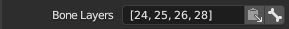
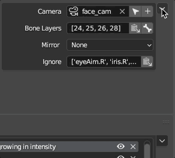

# Pose Library Template for Blender

Addon for creating and managing library poses for Blender 3D Animation Software.

Blender's [Pose Library](https://docs.blender.org/manual/en/latest/animation/armatures/posing/editing/pose_library.html) allows artists to store and retrieve poses to use in animation. It's an extremely valuable tool for teams to ensure consistency with their character's poses, and provides a streamlined workflow for blending in and out of poses. Unfortunately, it can be difficult to manage multiple poses, and re-creating poses quickly can become time consuming.

This addon provides a user friendly, panel-based UI for creating and managing poses. It allows teams to use a consistent template to generate poses all at once.

----

## Features
* Manage multiple **Categories** and **Poses** for each category.

  

* **Default Template** included with categories, poses, and cameras.

    

* Create **cameras** and tie them to each category.

  

* Quickly manipulate and orient the cameras for each category.

    

* Control **Bone Layers** for each category.

    

* Automatically toggle between **Bone Layers** as you navigate categories.

    

* **Mirror** poses.

    

* **Ignore** specific controls when creating poses.

    

* **Create pose library** with a single click.

    

* **Import** and **Export** templates.

    
