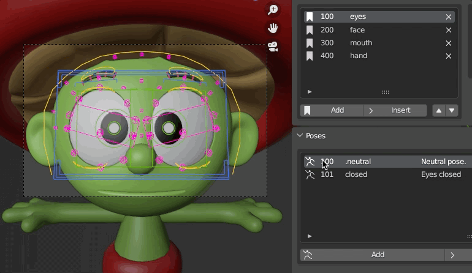

# Tutorial using Sprite Character from Blender Studio
This tutorial will demonstrate setting up a Pose Library from scratch using the [Sprite](https://studio.blender.org/characters/sprite/v1/) character from Blender Studio. You can follow along using your own character, or log into Blender Studio to download the character yourself.

Sprite Character from Blender Studio - (License CC BY 4.0)

One of the reasons we will demonstrate with this character is that it already has a pose library we can take advantage of. In the process of this tutorial, we will re-create the library and make it easy to update and organize.

## Table of Contents
- [Tutorial using Sprite Character from Blender Studio](#tutorial-using-sprite-character-from-blender-studio)
  - [Table of Contents](#table-of-contents)
  - [Prerequisites](#prerequisites)
  - [Set up your scene](#set-up-your-scene)
    - [Download the BlenderPoseLibraryTemplate addon](#download-the-blenderposelibrarytemplate-addon)
    - [Open Blender and Install the Addon](#open-blender-and-install-the-addon)
    - [Download the Sprite Character and open it in Blender](#download-the-sprite-character-and-open-it-in-blender)
    - [Save the file in the Asset Library Location](#save-the-file-in-the-asset-library-location)
    - [Set up animation defaults](#set-up-animation-defaults)
  - [Working with categories](#working-with-categories)
    - [Create your first category](#create-your-first-category)
    - [Adjust Library Template Defaults](#adjust-library-template-defaults)
    - [Create the next categories](#create-the-next-categories)
  - [Update frame range](#update-frame-range)
  - [Working with cameras](#working-with-cameras)
    - [Set up face cameras](#set-up-face-cameras)
    - [Setup Hand Camera](#setup-hand-camera)
  - [Category control settings](#category-control-settings)
    - [Set up bone layers](#set-up-bone-layers)
    - [Set up ignore controls](#set-up-ignore-controls)
  - [Working with poses](#working-with-poses)
    - [Create the first eye pose](#create-the-first-eye-pose)
    - [Generate the pose library](#generate-the-pose-library)
    - [Create more eye poses](#create-more-eye-poses)
    - [Create poses for the Face, Mouth, and Hand](#create-poses-for-the-face-mouth-and-hand)
  - [Clean up old poses](#clean-up-old-poses)
  - [Save your Scene](#save-your-scene)

----
## Prerequisites
1. This addon requires Blender 3.2+ to function correctly.

## Set up your scene
### Download the BlenderPoseLibraryTemplate addon
1. Download the zip file from Github and save it to your downloads directory.

### Open Blender and Install the Addon
1. Open Blender.

2. Open the Blender Preferences
   1. Choose **Edit -> Preferences**.
   2. Choose **Install**.
   3. Navigate to the **Downloads** directory.
   4. Choose the downloaded **zip**.
   5. Enable the addon by choosing the tick mark next to the name.

        

### Download the Sprite Character and open it in Blender
1. Navigate to https://studio.blender.org/characters/sprite.
2. Log in to Blender Studio by choosing **Login** on the web page.
3. **Download** the character.
4. **Open** Sprite in Blender.

    * If your pipeline encourages *linking* characters instead of opening them, you can link the character instead.

### Save the file in the Asset Library Location
In order for the pose library to be available for the rest of your production, you must save your .blend file in the location of your Assets Library. To learn more about the Asset Library, see the [Blender Asset Browser Documentation](https://docs.blender.org/manual/en/latest/editors/asset_browser.html).

1. Choose **Edit --> Preferences**.
2. Navigate to **File Paths**.
3. Under **Asset Libraries**, create a location for **Asset Library** if one doesn't already exist.
   * If there is an existing location, you can use that location to save your file.

   

    * You can create multiple asset library locations.

4. Save the blend file in this location with the name of the character.
   For example: `/Users/sjason/documents/Blender/Assets/sprite_library.blend`

### Set up animation defaults

When creating poses for your character, working with a default interpolation of **Constant** makes everything a lot easier.
1. Open the Blender Preferences by chooseing **Edit -> Preferences**.
2. Navigate to **Animation**
3. Under **F-Curves** set **Default Interpolation** to `Constant`

    

You are now ready to start using the Pose Library addon.

## Working with categories
The first step to creating the pose library is to create **Categories** for your poses. Categories are helpful ways to **organize** your poses into common features. For example, bone display layers, and camera position.

With the library that's included with Sprite, you can break up the poses into "suggested" categories, such as the following.

* Eyemask
* Eyes
* Face
* Hand
* Mouth

*Sprite suggested categories.*

We can use these as a starting point, and make modifications as required.

> ### Important Concept
> ---
> Each **Category** will be represented by a particular **frame range** in your Blender timeline, and each **Pose** will be on a particular **frame**. This allows you easily step through your poses and organize them effectively.

### Create your first category
1. Switch to the **Pose Library** tab in your 3D Viewer.
   * If you don't see the tabs, hit the `n` key on your keyboard to display it.
    
   * Notice that no categories exist yet.

2. Choose **Add First Category**.

   Based on the suggested category breakdown in the *Sprite suggested categories* image above, let's combine eyemask and eyes and create a category called `eyes`.

   1. For **Category Name** enter `eyes`.
   2. Leave **Mirror** to `none`.
      * The mirror option is used to copy poses from one side of the body to the other. It's best used for hands, when you want to pose one side, but also have the other side receive the same values.
   3. Enable **Create New Camera**.
      * This will automatically create a new camera for this category.

   4. Choose **OK**.

   

You will notice that a new category has been created called `eyes`. This category is placed at frame 100, is linked to a cammera `eyes_cam`, and has some default bone layers set up. You will also notice that it has created a pose on frame 100 called `.neutral`. This is a default setting that can be turned off if you want, but I've found it very helpful to always have a neutral pose to return to.

> ### Helpful Info
> ---
> The pose is named with a `.` in front so it will always be the first item listed in a category. that makes it easy for animators to find the pose.

You will also notice that the timeline has a **marker** on it at **frame 100**, and the marker is connected to **eyes_cam**.

By default, each **Category** will start at **frame 100**, and increment by **100 frames**. This means the *next* category will automatically start at **frame 200**, the next at **300**, and so on. This gives a healthy frame range for creating poses for each section. This *is configurable* if you would like to start at a different frame. For example, frame `0`.

### Adjust Library Template Defaults

To adjust these defaults, open the **Pose Library Tempalte** section at the top of the **Pose Library** tab.

Here you can see the **Category Start Frame** and **Frames Between Category** settings.
1. Adjust the **Category Start Frame** to `0`.
   * Notice how the **eyes** category now has a `0` next to it, and the marker in timeline is also set to frame 0.
   * You can manipulate these however you like, but for now set the **Category Start frame** back to `100`.
2. Minimise the **Pose Library Template** section. You don't need to see this display anymore.

### Create the next categories
Continue creating the categories for Sprite.
1. Add a **face** category
   1. In the **Categories** section, choose **Add**.
   2. For **Category Name** enter `face`.
   3. Set **Mirror** to `None`.
   4. Enable **Create New Camera**.
   5. Choose **OK**.

2. Add a **mouth** category
   1. In the **Categories** section, choose **Add**.
   2. For **Category Name** enter `mouth`.
   3. Set **Mirror** to `None`.
   4. Enable **Create New Camera**.
   5. Choose **OK**.

3. Add a **hand** category.
   1. In the **Categories** section, choose **Add**.
   2. For **Category Name** enter `hand`.
   3. Set **Mirror** to `L->R`.
        * We want the hands to be mirrored from the Left side (where you will pose) to the Right side, so we can use the same poses on both sides. This setting will make that happen automatically.
   4. Enable **Create New Camera**.
   5. Choose **OK**.

You should now have **four** pose categories set up for Sprite, ranging from **100** to **400**. The **timeline** should also show four markers with four cameras attached. These represent the **frame ranges** for your pose categories.

The frame range for your scene is probably not set correctly. In this case, it's set from frame 0 to 250, but our poses should range from 100 to 500. Let's adjust the frame range for our scene before we go any further.

## Update frame range
1. In the **Properties Panel** choose the **Output Properties** section.
2. Set your **Frame Start** and **End** values to `100` and `500` respectively.

    

    Now your scene has the correct frame range for your pose library.

3. **Save** your scene.

## Working with cameras
### Set up face cameras

The next step will be to set up your cameras for each category. We will take advantage of the **Helpful Shortcuts** tools to make this easier.

1. In the **Categories** list, choose **100 eyes** to switch to frame 100.
2. Open the **Helpful Shortcuts** section in the **Pose Library** tab.

    

3. Choose **Toggle Camera View** to switch your viewport to look through the **eyes_cam**.
    * You will find that the view changes to look through the camera, but it's not placed exactly where you want. That's okay, we can adjust it very easily.

4. Enable **Lock Camera View**.
5. Manipulate the 3d view to adjust the camera.
6. To make things a little faster, **select** one of the controls on the Sprite's face and choose **Frame Selected**. This will frame the control and allow you to line it up quicker.

<video width="926" controls>
<source src="../images/tutorial_013_adjustingCamera.mp4">
</video>

> ### Helpful note
> ---
> If you find that your camera is clipping, you can adjust the **Clip Start** on the camera by swithcing to **Object Mode**, and then selecting the camera and changing the **Clip Start** property in the **Camera Properties Panel**
>
> 
>
> Make sure to switch back to **Pose Mode** when you're finished.

7. Continue setting up the cameras for the **face** and **mouth** sections. Notice as you jump back and forth between sections, the camera will automatically update to show the correct view for each section.

> ### Note
> ---
> The hand category will require re-positioning of the character, so let's just get the face-related categories set up first.

8. Once you're done, be sure to **disable** **Lock Camera View** in the **Helpful Shortcuts** section of the panel before continuing to the hand.

### Setup Hand Camera

To make it easier to get a clean view of the hand when posing the character, we'll need to adjust the body out of the way and raise the hand.

1. Switch to the first category **eyes** to set the frame to 100.
2. Create a default body neutral pose on frame 100.
   1. In Pose mode, select one of the visible controls.
   2. Hit `Shift+M` in order to bring up the Layer picker.
      * If you're using the **Sprite** character, you are using a **Cloud Rig**. Cloud Rigs have a special bone layer picker that is easy to understand, with labels that represent poses. If you aren't using Sprite, your bone picker may just be the default Blender bone layers.

   3. Enable the display of all the controls by choosing each layer.

        

   4. Choose **OK**.

3. Hit `a` on the keyboard to select all the controls.
4. Hit `i` on the keyboard to key all the controls at frame 100.
5. Switch to the **hand** category on frame **400**.
6. Using the controls, lean the body over and lift the hand up in the air until it's relatively easy to get a clean pose. I've included a screenshot of the pose I used - feel free to copy, or adjust as you see fit.

    

7. Don't forget to set a keyframe by hitting `a` to select all the controls, and `i` to set a key at frame 400.
8. Now using the **Toggle Camera View**, **Lock Camera View**, and **Frame Selected** shortcuts, position the camera for the pose library.

    

   * If you jump between the categories, you should see appropriate cameras for each of the categories. Feel free to adjust as required until you are happy with what you have.

## Category control settings
### Set up bone layers

Next we will want to set up the controls that will be used for each **Category**. This is done by using **Bone Layers**. By setting them bone layers for each category, you don't need to worry about being consistent with your control usage. This is because you will always have the same controls keyed per pose in a category.

1. Choose the **eyes** category.

> ### Bone layer display
> ---
> The bone layers display a list of numbers. Example: `[0, 3]`. This is because bone layers in Blender are represented by a series of numbers on the **Armature**. Learn more about the armatures in the [Skeleton Armature Layers](https://docs.blender.org/manual/en/latest/animation/armatures/properties/skeleton.html#bpy-types-armature-layers) section of the Blender manual.

2. Next to the **Bone Layers** item, choose the **Bone** icon to open the **Select Armature Layers** dialogue.

   

3. Choose the layers you want to keyframe for the **eyes** category. For Sprite, this includes **Face**, **Lattice**, **Evil Eyebrows**, **Face Secondary**, and **FK Secondary** (for some reason, FK Secondary contains the properties to enable the angry brows).

    

   > ### Note
   > ---
    > You don't need to use every once of these controls when creating eye poses, but you should include any layers that contain any controls you might want to key. You can always add controls to ignore when creating poses for this section later.

4. To apply these layers to the category, be sure to choose the **Set active layer** icon *next* to the **Bone** icon. This will set the layers in the field. For Sprite, it sets them to `[3, 9, 18, 19]`.

### Set up ignore controls

You might want to ignore certain controls when creating eye poses. For example, because Sprite's face poses also contain mouth controls, we can ignore those when creating poses.

This can be done by selecting certain controls and hitting the **Set controls to ignore** button.

> ### Helpful tip
> ---
> One way to ensure you have the right controls selected is to *hide* the controls that you *don't* want to ignore. Then, once you've hidden all the controls you don't want to ignore, hit the `a` key to select all the visible controls, and choose **Set controls to ignore**. Then re-show the hidden controls by choosing `option-h` (or `alt-h` on Windows).

1. Select the controls that you *want* to keyframe around the top of the head that have to do with the eyes.
2. As you're selecting the controls, hit `h` on the keyboard, or choose **Pose -> Show/Hide -> Hide Selected** to hide them.

    

3. Hit `a` on the keyboard to select all of the visible controls.
4. Choose the **Set controls to ignore** button.
5. Show the hidden controls by hitting `option-h`, or choose **Pose -> Show/Hide -> Reveal Selected**.
6. Now in the **Helpful Shortcuts** settings, be sure to enable **Hide Ignore Controls**. This will automatically hide any controls specified in the **Ignore** settings.

## Working with poses
### Create the first eye pose

Now that you've got your controls set up, let's create our first eye pose for the library.

Actually, the first pose will be the .neutral one, and that's already been created since we set a key on frame 100. So let's take a look at the poses available in the library that come with Sprite and choose one that would be a good first pose.

   

I think the eyes closed would be a good first pose to create.

1. In **Categories** section, choose **eyes**.
2. In the **Poses** section, choose **Add**.
   1. For **Pose Name**, enter `closed`.
   2. For **Pose Description**, enter `Eyes closed`.
   3. Leave **Skip Pose** disabled.
   4. Choose **OK**

   

3. Once you have created the pose, you will see frame 101 added to the list of poses.

   

   > ### Note
   > ---
   > The pose itself has not yet been created. This has just created a "slot" on frame 101 for you to keyframe the character with that pose.
   >
   > Remember, you will first create all your poses for the library on various keys, and then create all your poses at once.

4. Pose the character with their eyes closed. If you are using the Sprite character, you can use the *existing* pose in the library to create the closed eye pose.
   1. Select all the controls by hitting `a`.
   2. Switch to the **Animation** tab.
   3. Double-click on the existin **closed eye pose**.
      * You should see your Sprite character with their eyes closed.

5. Don't forget to *set a keyframe* for the pose by hitting `i` on the keyboard. You can speed up the process by enabling **Auto-Key** in Blender. To learn more about auto keyframing, see the  [Blender Documentation] (https://docs.blender.org/manual/en/latest/animation/keyframes/editing.html).

6. Toggle back and forth between the closed eye pose and the .neutral pose. Notice how the frame changes, and the pose is updated.

   

### Generate the pose library

Now that you have your first two poses in the **Eyes** category, and a few other categories set up, let's go ahead and generate the pose library.

1. At the bottom of the **Pose Library** panel, choose **Create Pose Library**.

Once the library has been created, you will see a info box letting you know how many poses were created, how many failed, and whether or not any were skipped.

   

As you can see from the image above, in this case 5 poses were created successfully. The first two were in the **eyes** category - .neutral and closed. The other three were .neutral poses in the other categories: face, mouth, and hand.

Switch to the **Animation** tab to see the poses created.

   

   > ### Note
   > ---
   > If you are using the Sprite character, you'll see that the original poses were not removed. That's because they aren't named the same as the poses we are creating. Don't worry about that for now, we will clean them up later.

Congratulations - you have created your first library using the Pose Library template addon.

### Create more eye poses

Continue through the rest of the eye poses and make more of them the same way you did the first.

<video width="926" controls>
<source src="../images/tutorial_027_eyePoses.mp4">
</video>

Once you've created the poses, feel free to choose **Create Pose Library** to generate these addional poses in the library.

   

### Create poses for the Face, Mouth, and Hand

Now that you understand how to create poses, you can create poses for the face, mouth, and hand categories.

Don't forget to set your **Display Layers** property, and include any controls you wish to **ignore**.

Once finished, again choose **Create Pose Library** to generate additional poses.

   

## Clean up old poses

We still have both types of poses in this Sprite file - the ones that originally came with the file, and the new ones you generated. To remove the old ones, you can remove old assets and then re-create the library.

1. In the **Outliner**, change the view to **Blender File** to see all the **Data Blocks** in the current file.

      

2. Open the **Actions** item.

   

3. Scroll down until you see actions that have an Asset Library icon in front of them. 

4. Select all of the Asset Library Actions for the Sprite. These are the older pose assets.

   

5. Right-click on the selected asset library actions and choose delete.

   * This will delete all the old poses from the asset library.

   

## Save your Scene

1. Now save your scene to make your library usable by other artists.

